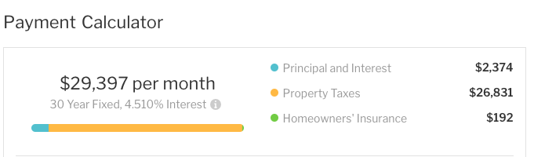
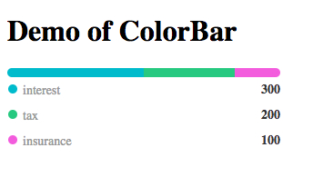

# React color bar

This is a color bar built to display data breakdown in a horizontal bar.

Inspired by color bar of `Payment calculator` in [Redfin](https://www.redfin.com).



## Screenshot



## Install

```
$ npm i react-color-bar
```

## Demo

[Online Demo](https://joyjoy993.github.io/react-color-bar/)

Run local demo

```
$ npm install && npm run dev
```
Go to [http://127.0.0.1:8000](http://127.0.0.1:8000) to check to demo.

## Usage
```
import React, { Component } from 'react';
import ColorBar from 'react-color-bar';
 
class App extends Component {
    render() {
        const data = [
              {
                  value: 300,
                  color: '#21bbce',
                  legendLabel: 'interest',
                  legendValue: 300,
                  tooltip: 'interest is $300',
              }, {
                  value: 200,
                  color: '#4bc97d',
                  legendLabel: 'tax',
                  legendValue: 200,
                  tooltip: 'tax is $200',
              }, {
                  value: 100,
                  color: '#eb5be1',
                  legendLabel: 'insurance',
                  legendValue: 100,
                  tooltip: 'insurance is $100',
              },
          ];
          return (
            <div>
                <ColorBar data={data} />
            </div>
        );
    }
}
 
export default App;
```

## Options
| Name                 | Type      | Default           | Description                                  |
|----------------------|-----------|-------------------|----------------------------------------------|
| data                 | array     |                   | Array of data [object](https://github.com/joyjoy993/react-color-bar#data-property)                                             |
| rootStyle             | object    |                   | Style for root container                     |
| barContainerStyle     | object    |                   | Style for bar container                      |
| legendContainerStyle  | object    |                   | Style for legend container                     |
| legendRowContainerStyle           | object    |                   | Style for container of legend row                    |
| legendRowTitleContainerStyle          | object    |                   | Style for container of title in legend                     |
| legendRowTitleStyle           | object    |                   | Style for title of legend row                  |
| legendRowBodyStyle            | object    |                   | Style for body of legend row                  |
| tooltipType           | String    | info                  | Tooltip theme for react-tooltip [Types](https://github.com/wwayne/react-tooltip#options)                  |
| tooltipPosition           | String    | bottom                 | Tooltip placement for react-tooltip [Types](https://github.com/wwayne/react-tooltip#options)                  |
| tooltipStyle          | object    |                   | Style for container of tooltip                  |

## Data property
| Name                 | Type      | Description                                  |
|----------------------|-----------|-------------------|----------------------------------------------|
| value                 | Number      | Value displayed in bar                                 |
| color                 | String      | Color in bar                                  |
| legendLabel                 | node      | Legend label                                  |
| legendValue                 | node      | Value displayed in legend                                  |
| tooltip                 | node      | Tooltip                                  |

### Example
```
const data = [
      {
          value: 300,
          color: '#21bbce',
          legendLabel: 'interest',
          legendValue: 300,
          tooltip: 'interest is $300',
      }, {
          value: 200,
          color: '#4bc97d',
          legendLabel: 'tax',
          legendValue: 200,
          tooltip: 'tax is $200',
      }, {
          value: 100,
          color: '#eb5be1',
          legendLabel: 'insurance',
          legendValue: 100,
          tooltip: 'insurance is $100',
      },
  ];
```


